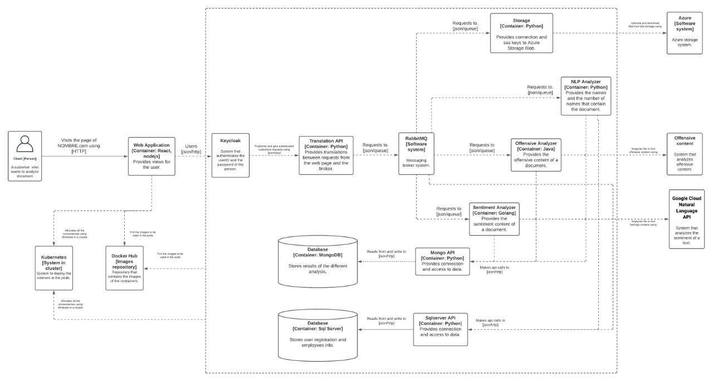

# DocumentAnalyzer3.0
Proyecto 3 - Arquitectura de Software

# Core diagrams

## Level 1: System Context diagram
||
|:--:|
|**Figure 1**: System Context diagram.|

## Level 2: Container diagram
||
|:--:|
|**Figure 2**: Container diagram.|

## Level 3: Component diagram
||
|:--:|
|**Figure 3**: Component diagram.| 

## Level 4: Pipeline diagram
||
|:--:|
|**Figure 4**: Component diagram.| 
